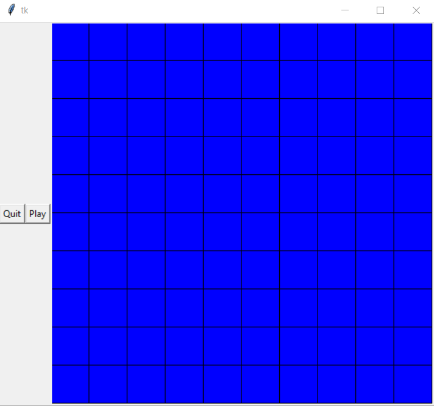
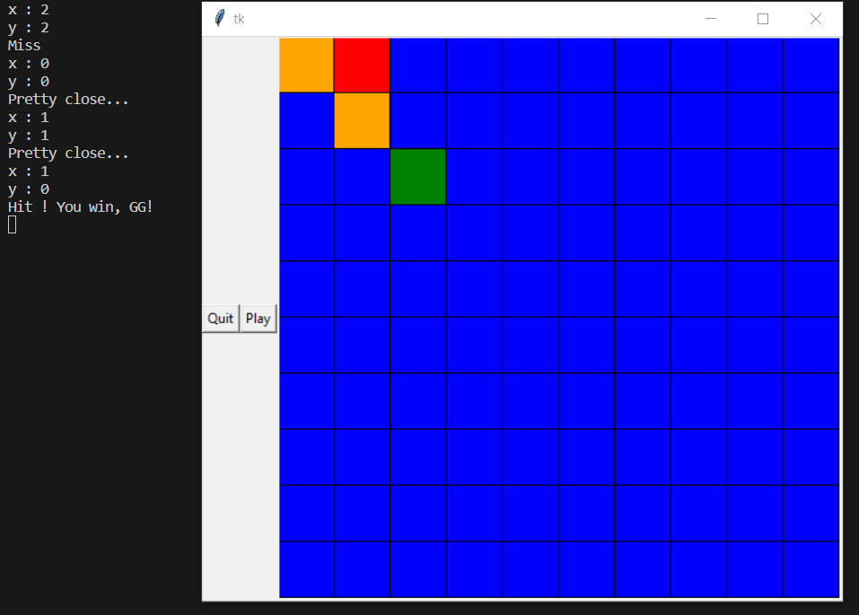

# Battleship

## Description
Small project realized back in highschool of the Battleship board game.
It's a far more simpler version of it where you only have 1 ship to find and destroy in this 10x10 sized grid within 5 tries in order to win.
To choose coordinates, you have to enter them manually in the terminal.
It's also very "non-reliable" version, you really have to be careful to enter valid coordinates, otherwise you'll get an index out of bouds and you also have to enter a number to avoid errors, there is no security whatsoever... I'll address these problems only if one day I decide to make a 2.0 of this game.

## Author
Realised by Henrique D.M.M

## Demo images
### Start of a game

### End of a game

